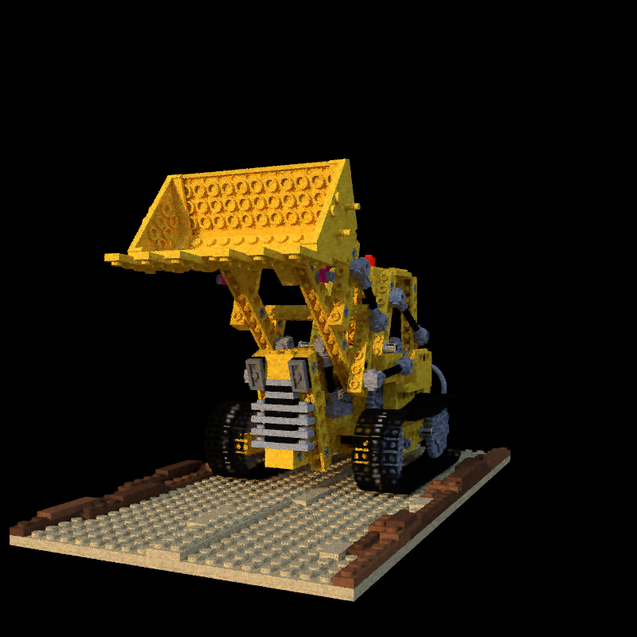

# Denoinsing by NeRF
This project is denoising image using NeRF-based method.
Largely based on [mitsuba3](https://mitsuba.readthedocs.io/en/stable/index.html)  renderer.

## How-to use

1. Open Radience_field_reconstruction.ipynb file. (rover, lego) and run all cells. (You can change the angle.) 
	The images will be saved in obj/source directory. 
2. Open jbf.ipynb and edit angle, spp, obj and run all. Joint-Bilateral Filtered images will be saved in obj/jbf_cv2 directory.

## Pipeline
1. Generate images using high spp, so that images have low noise. In this project, I used 4096spp.
2. Train NeRF model by high-spp images. 
3. Generate images using low spp, and the images will have high noise.
4. Apply joint bilateral filter to low spp images using NeRF images as guide image. It can be simply used as we just need to inference to do filtering without training.

## Comparing result
Use tev(https://github.com/Tom94/tev) to compare exr images. -> Check RSE error between reference image & guide image(NeRF), lowref, self-filtered(Bilateral) image. 
